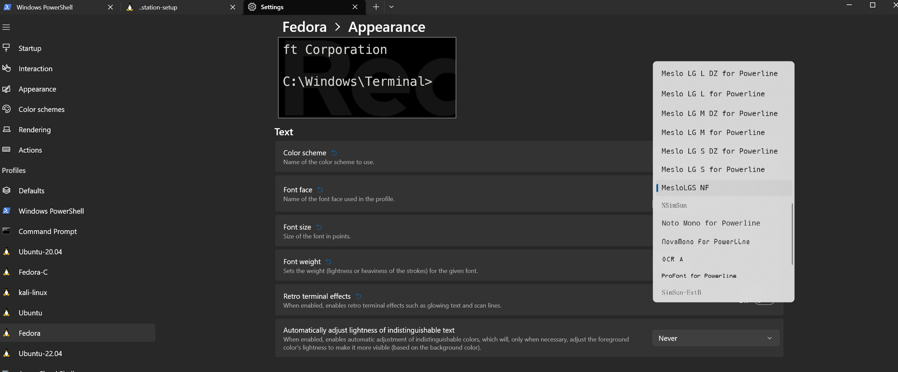
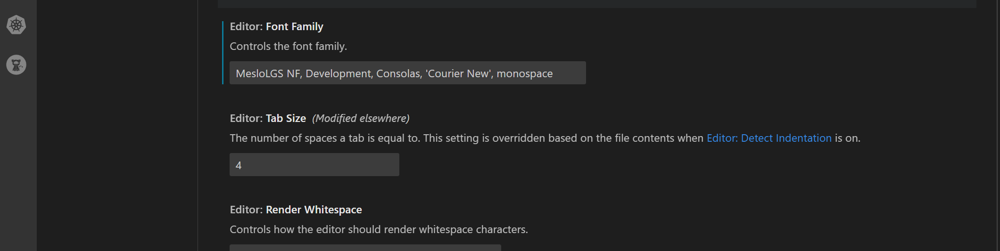

= Guidance on these fonts
Author Name <ryan@clements.me> v1.0
:icons: font
ifdef::env-github[]
:tip-caption: :bulb:
:note-caption: :information_source:
:important-caption: :heavy_exclamation_mark:
:caution-caption: :fire:
:warning-caption: :warning:
endif::[]

This document stores the current font setups I use for my workstation an vscode 
setups.

== General Linux workstation:

I've been using https://github.com/romkatv/powerlevel10k/blob/master/README.md[powerlevel10k] 
as my primary `zsh` theme. I use https://ohmyz.sh/[oh my zsh] ontop of zsh to 
control themes and plugins.

IMPORTANT: For 
https://github.com/romkatv/powerlevel10k/blob/master/README.md[powerlevel10k]
to operate correctly with all the best icons and a good looking font, I use
the MesloLGS NF patched fonts below.

=== Instructions for Windows:

. Click on each font to download:
+
* link:++resources/fonts/MesloLGS NF Bold Regular.ttf++[MesloLGS NF Regular]
* link:++resources/fonts/MesloLGS NF Bold Bold Italic.ttf++[MesloLGS NF Bold Italic]
* link:++resources/fonts/MesloLGS NF Bold Italic.ttf++[MesloLGS NF Italic]
* link:++resources/fonts/MesloLGS NF Bold Bold.ttf++[MesloLGS NF Bold]
+
. Click on each font in your downloads folder to install.

. Open Windows Terminal and configure the appropriate WSL2 session, such as 
Fedora, to use the `MesloLGS NF` font
+

+
. Configure `vscode` to use the `MesloLGS NF` font
+

+
With that step complete, you will now have the proper fonts setup for `vscode` 
terminal shell and zsh's https://github.com/romkatv/powerlevel10k/blob/master/README.md[powerlevel10k]

